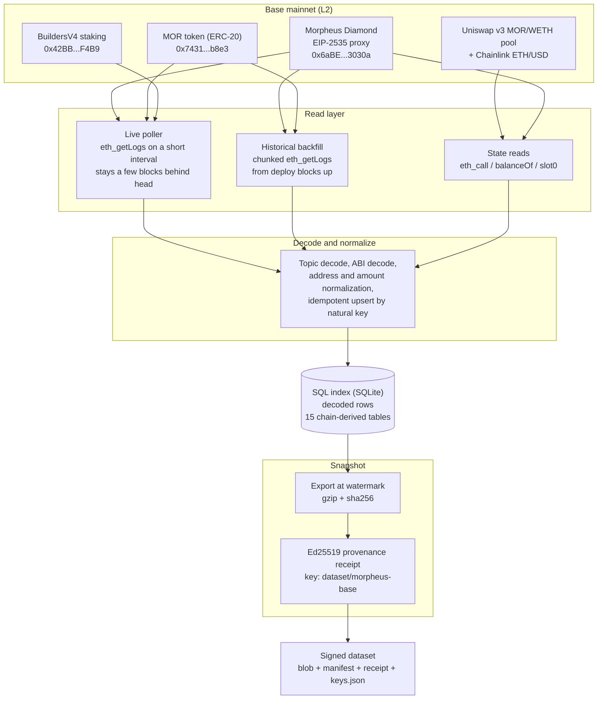

# How this dataset is produced

This document explains how raw Base mainnet chain events become the tables in this dataset, and how to reproduce every number from Base yourself. Every contract address, event topic, deploy block, and parameter below comes from the indexer that produces the snapshot.

The short version: an open-source indexer reads a fixed set of Base L2 contracts with `eth_getLogs`, decodes the events, normalizes them into SQL rows, and a separate tool cuts a point-in-time snapshot at a completeness watermark, gzips it, and signs it with an Ed25519 key committed to this repo. Nothing here needs a private data source. The same contracts and events are readable by anyone with a Base RPC endpoint.

## Contents

1. [Pipeline at a glance](#pipeline-at-a-glance)
2. [Source: the exact contracts and events](#source-the-exact-contracts-and-events)
3. [How the chain is read](#how-the-chain-is-read)
4. [Decode and normalize: raw logs to clean rows](#decode-and-normalize-raw-logs-to-clean-rows)
5. [The snapshot: cut, sign, verify](#the-snapshot-cut-sign-verify)
6. [Reproducibility and scope](#reproducibility-and-scope)

## Pipeline at a glance



## Source: the exact contracts and events

Everything in the dataset originates from three Base mainnet contracts, plus two on-chain price sources read by `eth_call`. Each contract is scanned from its Base deploy block, the first block on Base where the address has code.

| Contract | Address | Deploy block | Role |
|----------|---------|--------------|------|
| Morpheus Diamond (EIP-2535 proxy) | `0x6aBE1d282f72B474E54527D93b979A4f64d3030a` | 39,593,197 (2025-12-17) | compute marketplace: sessions, bids, providers, models, economics |
| MOR token (ERC-20, 18 decimals) | `0x7431aDa8a591C955a994a21710752EF9b882b8e3` | 15,002,375 (2024-05-27) | token transfers, holder set |
| BuildersV4 (builder subnet staking) | `0x42BB446eAE6dca7723a9eBdb81EA88aFe77eF4B9` | 24,381,796 (2024-12-30) | builder subnets, stakes, deposit/withdraw/claim events |

These are the contracts' Base deploy blocks, and they are where the historical backfill starts scanning up from.

### Event to table mapping

Each row below is a specific log topic (topic0 is the `keccak256` of the event signature) fetched by `eth_getLogs`, and the dataset table it lands in. Topic hashes are the exact filters the indexer uses.

| Contract | Event (topic0) | Signature | Becomes |
|----------|----------------|-----------|---------|
| Diamond | `0x2bd7c890...bfbf4839` | `SessionOpened` | one row in `sessions` (enriched, see below) |
| Diamond | `0x337fbb0a...5ac3914a` | `SessionClosed` | updates the matching `sessions` row: `is_active=0`, `closed_at`, `close_tx_hash` |
| Diamond | `0xfc422bb6...04bff6f6` | `MarketplaceBidPosted(provider, modelId, nonce)` | one row in `bids`; referenced models flow into `models` |
| Diamond | `0x409dfc0f...d2814883` | `MarketplaceBidDeleted(provider, modelId, nonce)` | soft-deletes matching `bids` rows (`deleted_at` set) |
| Diamond | `0x8faa7087...de0aeb673` | `DiamondCut` (EIP-2535 facet upgrade) | one row in `diamond_upgrades` (facet changes, block, tx) |
| MOR token | `0xddf252ad...f523b3ef` | `Transfer(from, to, value)` | discovers wallets into `mor_holders` (from and to, minus the zero address) |
| BuildersV4 | `0x6c7131e7...1619d2db` | `BuilderUserDeposited` | `builder_events` (type `deposit`); recomputes `builder_stakes`, `builder_subnets` totals |
| BuildersV4 | `0x91ce5144...542da4a0d` | `BuilderUserWithdrawn` | `builder_events` (type `withdraw`); recomputes `builder_stakes` |
| BuildersV4 | `0x58d15e55...4c803f00` | `AdminClaimed` | `builder_events` (type `claim`) |
| BuildersV4 | `0xfc07de8e...570076742` | `SubnetCreated` | one row in `builder_subnets` |
| BuildersV4 | `0xb402427f...80a0a4ee0` | `SubnetEdited` | updates `builder_subnets` metadata |
| BuildersV4 | `0x2b8c2cd9...e1acb9ac5` | `FeePaid` | `builder_events` (type `fee`) |

### Data read by contract call, not by event

Some columns cannot be reconstructed from event topics alone, so the indexer reads them directly with `eth_call` at the relevant block or at head. These are still on-chain reads, re-derivable by anyone:

| Table / columns | Source | Method |
|-----------------|--------|--------|
| `sessions` full detail (stake, model, timestamps, participants) | Diamond | `getSession(id)` and `getBid(bidId)` on each `SessionOpened` |
| `bids` full detail (price, nonce, timestamps) | Diamond | `getBidId(...)` then `getBid(bidId)` |
| `providers`, `models` | Diamond | `getProvider`, `getModel` discovery calls |
| `mor_holders.mor_balance_wei` / `eth_balance_wei` | MOR token, Base | `balanceOf(wallet)` and `eth_getBalance`, at head (matches Basescan) |
| `network_economics`, `economics_history` | Diamond | `getComputeBalance(ts)`, `totalMORSupply(ts)`; staking factor is derived from those |
| `price_history` (`usd`, `eth_usd`) | Uniswap v3 MOR/WETH 0.3% pool + Chainlink ETH/USD | pool `slot0()` sqrtPriceX96 for MOR/WETH, Chainlink `latestRoundData()` for ETH/USD, multiplied |
| `gas_costs` | Base tx receipts | `eth_getTransactionReceipt` on each session open/close tx (gas used, effective price, ETH cost) |
| `provider_stats`, `wallet_stats` | derived | rollups computed from `sessions` (counts, durations, outcomes) |

The MOR/USD price source is the Uniswap v3 MOR/WETH 0.3% pool at `0x37ecd41f5a01b23a3d9bb3b4ddfef4ed455d6fd3` (token0 = WETH, token1 = MOR), read against the Chainlink ETH/USD aggregator on Base at `0x71041dddad3595F9CEd3DcCFBe3D1F4b0a16Bb70`. This is an on-chain read, not a third-party exchange feed.

## How the chain is read

The method is `eth_getLogs` polling against a Base RPC endpoint. The same calls work from any node; nothing here needs a private source. Two readers share one set of decoders and one set of idempotent upserts, so a block scanned by either produces identical rows. One keeps the index current at the head; the other fills the deep past.

### Live polling (freshness)

A poller runs on a short interval. Each pass:

1. Reads the current chain head (`eth_blockNumber`) and steps back a few blocks to a safe upper bound. Staying behind the tip means a short reorg near the head cannot be indexed and then orphaned. Base finalizes in roughly 2 blocks (about 4 seconds), so a handful of blocks is a comfortable margin.
2. Requests the relevant event topics for the range `[last_indexed_block + 1, safe_head]`, bounded to a maximum span per request, with one `eth_getLogs` call per contract. Because `eth_getLogs` returns only matching events rather than every block, one pass covers a large gap cheaply: a multi-day backlog is a single call returning a few thousand events, not one call per block.
3. Advances the cursor only if every call in the pass succeeded. An RPC error returns no events, which looks the same as a genuinely empty range, so on any failure the cursor is held and the exact range is retried on the next pass. A cursor that moves only on confirmed success cannot silently lose blocks.

Builder events are polled on their own cursor under the same rules. Those two cursors are why the completeness watermark is the minimum of both (see below).

### Historical backfill (depth)

The live cursor is never rewound to fill history; that would park the index in the past. A separate pass re-scans explicit `[from, to]` ranges from each contract's Base deploy block forward, in bounded chunks, using the same decoders and upserts as the live poller. Re-running an already-complete range is a no-op, so the backfill is resumable and runs comfortably in small batches against a rate-limited endpoint. The holder history in particular is a dedicated pass over MOR `Transfer` events from the token's Base deploy block (15,002,375) forward, which is how the dataset accounts for wallets that acquired MOR and held from before live indexing began.

### The watermark

The manifest records a single `watermark_block`. It is defined as:

```
watermark_block = min(last_event_block, last_builder_event_block)
```

This is the completeness line: the highest Base block through which both the compute event stream and the builder event stream are fully indexed. Resuming an index from the watermark cannot skip an event, because both streams are known to be complete at or below it. Rows for a few blocks past the watermark may be present, since indexing is continuous, but they are not guaranteed complete. Treat the watermark, not the newest row, as the boundary of trust.

## Decode and normalize: raw logs to clean rows

Raw logs are turned into rows with a small, consistent set of rules:

- Topic decoding. Indexed parameters are read from `topics[1..3]`. Addresses packed into a 32-byte topic are unpacked by taking the low 20 bytes (`topic.slice(26)`). Session and bid ids are the raw 32-byte topic words.
- ABI decoding. Non-indexed fields and full struct detail (session stake, timestamps, bid price, subnet metadata) come from decoding the `eth_call` return of the corresponding getter, using the contract ABI.
- Address normalization. Every address is lowercased before storage and comparison, so joins and grouping are case-stable.
- Amount normalization. On-chain token amounts are stored as wei-scale decimal strings (18 decimals) rather than floats, preserving exact values; divide by `1e18` for whole MOR. Timestamps are unix seconds, UTC.
- Dedup and upsert by natural key. Rows are written with idempotent upserts keyed on the natural on-chain identifier: `sessions.id`, `bids.bid_id`, `mor_holders.wallet`, and for builder events a unique index on `(tx_hash, log_index, event_type)`. Re-seeing an event (a retry, an overlapping backfill chunk, a reorg replay) collides on that key and does not double-count.

Raw versus derived:

- Raw (direct from a single event or a single contract read): session lifecycle, bids, builder events, MOR transfers/holders, diamond upgrades, gas costs, price points.
- Derived (computed from the raw rows): `provider_stats` and `wallet_stats` are rollups over `sessions`; `network_economics.staking_factor` is computed from the compute balance and total supply reads; holder balances are a separate `balanceOf` read at head rather than a running sum of transfer values (netting transfers is only correct if every transfer is applied exactly once from a zeroed start, which a resumable free-tier re-scan cannot guarantee, so the authoritative balance is read directly).

## The snapshot: cut, sign, verify

A snapshot is a deterministic export of the chain-derived tables at the watermark, produced by [`scripts/make-snapshot.mjs`](../scripts/make-snapshot.mjs):

1. Read the watermark. The tool reads `last_event_block` from the indexer's sync state and `last_builder_event_block` from the builder sync state and takes the minimum. It refuses to build if there is no event cursor.
2. Export. It dumps 15 chain-derived tables as data-only SQL (`providers`, `bids`, `sessions`, `models`, `provider_stats`, `gas_costs`, `network_economics`, `economics_history`, `builder_subnets`, `builder_stakes`, `builder_events`, `mor_holders`, `diamond_upgrades`, `wallet_stats`, `price_history`) and separately captures the schema those tables were dumped under.
3. Compress and hash. The SQL is gzipped (level 9) and the blob's `sha256` is computed. The schema file is hashed too.
4. Sign. It builds a canonical `manifest.json` (watermark, chain head at export, per-table row counts, blob sha256 and sizes, schema hash, excluded-table list) and signs an Ed25519 provenance receipt over the canonicalized manifest, using a key derived at path `dataset/morpheus-base`. The public key is written to [`keys.json`](../keys.json), and the receipt to `morpheus-ai-base-data.receipt.json`. The freshly signed receipt is self-verified before the tool exits.

The signing key is passed in by environment (`DATASET_SIGNING_MNEMONIC`), and the source database by environment (`SOURCE_DB`), so the tool is not wired to any single operator; anyone with a compatible index and the key can produce a snapshot in the same format.

### Verifying a snapshot offline

Verification touches only files in this repo. There are no network calls and no dependency on any live service. [`verify.mjs`](../verify.mjs) checks five things:

1. the downloaded blob's `sha256` matches `manifest.json`,
2. the receipt's Ed25519 signature is internally valid,
3. the receipt was signed by the current key published in `keys.json`,
4. the receipt commits to this exact manifest (the content signature is over the canonical manifest bytes),
5. the shipped `schema.sql` matches the hash recorded in the manifest.

```bash
npm install
node verify.mjs morpheus-ai-base-data-<block>.sql.gz
```

A pass means these exact bytes were produced and signed by the holder of the dataset key and were not altered in transit. To confirm the numbers themselves, re-derive any figure from Base with the filters and calls above.

## Reproducibility and scope

Every figure comes from the public Base contracts and events listed above. With any Base RPC endpoint, the same `eth_getLogs` topic filters over the same block ranges, the same getter calls, and the same normalization rules reconstruct the same tables. The signature attests who produced this copy and that it is unaltered; the numbers rest on the chain. Data is complete through `watermark_block`; rows past it may exist but are not guaranteed complete.

The dump is the 15 chain-derived tables above; `manifest.json` lists the included tables under `tables` and the excluded ones under `excluded_tables`.
